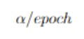
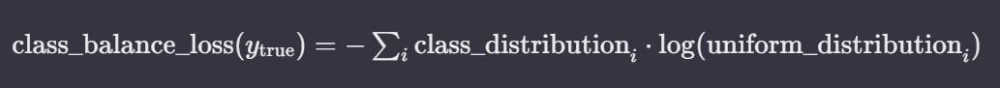
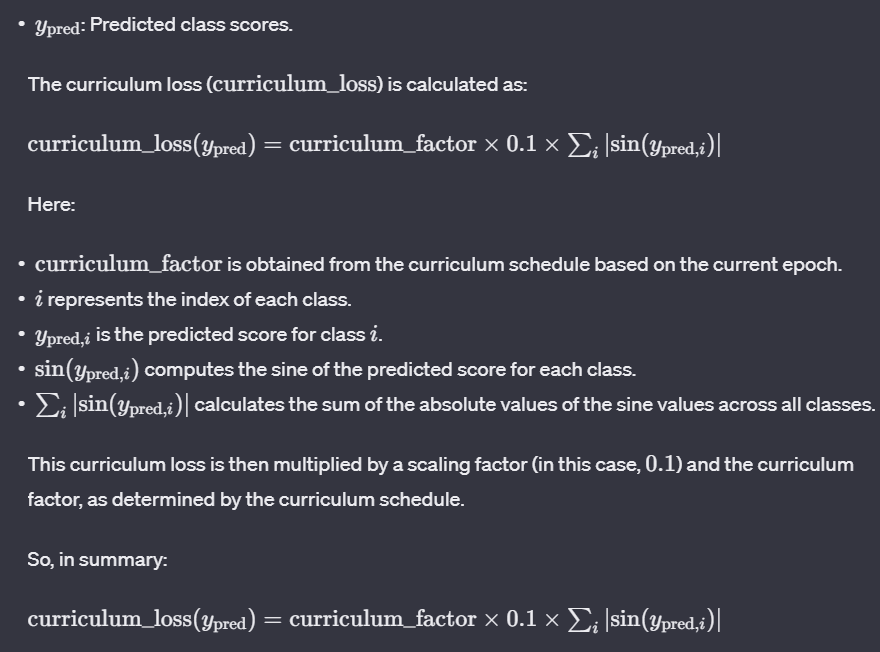

Name -- Prakhar Pratap Singh

Roll No. -- 22075102 and 22074024

Group No. -- 63 (Prakhar Pratap Singh and Pratham Agarwal)

**[Google Colab link]{.underline}
:-**[[https://colab.research.google.com/drive/1elILhdkU_eLoKOyvkO_beWpoh80MuidZ?usp=sharing]{.underline}](https://colab.research.google.com/drive/1elILhdkU_eLoKOyvkO_beWpoh80MuidZ?usp=sharing)

The DynamicLoss function is designed to be a flexible and customizable
loss function in TensorFlow/Keras. Let\'s break down each part of the
DynamicLoss class:

**[Initialization:]{.underline}**

def \_\_init\_\_(self, learning_rate, curriculum_schedule, \*\*kwargs):

> super(DynamicLoss, self).\_\_init\_\_(\*\*kwargs)
>
> self.learning_rate = learning_rate
>
> self.curriculum_schedule = curriculum_schedule
>
> self.epoch = 0 \# To keep track of the current epoch
>
> • **learning_rate**: This is a parameter that scales the contribution
> of the learning progress component in the loss function.
>
> • **curriculum_schedule**: This is a function that takes the current
> epoch as an argument and returns a curriculum factor. The curriculum
> factor is used to scale the contribution of the curriculum loss
> component.
>
> • **epoch**: This variable is used to keep track of the current epoch
> during training.

[**Loss Calculation**:]{.underline}

def call(self, y_true, y_pred):

> \# Custom loss components (modify as needed)
>
> standard_loss = tf.keras.losses.categorical_crossentropy(y_true,
> y_pred)
>
> learning_progress_loss = self.learning_rate \*
> self.learning_progress()
>
> class_balance_loss = self.class_balance_loss(y_true)
>
> curriculum_loss = self.curriculum_loss(y_pred)

dynamic_loss = standard_loss + learning_progress_loss +
class_balance_loss +
curriculum_loss{width="1.0in"
height="0.4666655730533683in"}

> return dynamic_loss

\* [**standard_loss**:]{.underline} This is the standard categorical
cross-entropy loss between the true labels (y_true) and the predicted
labels (y_pred).

\* **[learning_progress_loss]{.underline}**: This component represents a
custom loss term that increases linearly with epochs. It is scaled by
the specified learning rate (self.learning_rate).

\* [**class_balance_loss**:]{.underline} This component penalizes class
imbalance. It calculates the cross-entropy loss between the average
class distribution in y_true and a uniform distribution.

\* [**curriculum_loss**:]{.underline} This component represents a
curriculum-based loss term. It is based on the sine of y_pred values and
is scaled by a curriculum factor obtained from the curriculum_schedule
function.

**The** **final** **dynamic_loss** **is** **the** **sum** **of**
**these** **individual** **components**.

**Learning** **Progress** **and** **Class** **Balance** **Loss**
**Functions:**

def learning_progress(self):

> \# Example: Learning progress increases linearly with epochs
>
> return self.epoch / num_epochs \# Adjust as needed

def class_balance_loss(self, y_true):

> \# Example: Penalize class imbalance
>
> class_distribution = tf.reduce_mean(y_true, axis=0)

return tf.keras.losses.categorical_crossentropy(class_distribution,
tf.ones_like(class_distribution) / len(class_distribution))

> • **learning_progress**: This function defines the learning progress,
> which increases linearly with epochs. It is used in the calculation of
> the learning progress loss.
>
> • **class_balance_loss**: This function penalizes class imbalance by
> calculating the cross-entropy loss between the average class
> distribution in y_true and a uniform distribution.

{width="7.35902668416448in"
height="3.881943350831146in"}{width="7.35902668416448in"
height="0.6479155730533683in"}

**Curriculum** **Loss** **Function:**

def curriculum_loss(self, y_pred):

> \# Example: Curriculum loss based on the sine of y_pred values
>
> curriculum_factor = self.curriculum_schedule(self.epoch)
>
> return curriculum_factor \* 0.1 \*
> tf.reduce_sum(tf.abs(tf.math.sin(y_pred)))

**curriculum_loss** : This function calculates a curriculum-based loss
term. It is based on the sine of y_pred values and is scaled by a
curriculum factor obtained from the curriculum_schedule function.

{width="7.333333333333333in"
height="5.433333333333334in"}

**Learning** **Progress** **Tracking:**

def on_epoch_end(self, epoch, logs=None):

> self.epoch = epoch
>
> • on_epoch_end: This method updates the self.epoch variable at the end
> of each epoch, ensuring that the learning progress and curriculum loss
> functions get the correct epoch information.

In summary, the DynamicLoss function is a versatile custom loss function
that allows you to incorporate various components into your neural
network training process. It includes standard cross-entropy loss,
learning progress loss, class balance loss, and curriculum loss, each of
which can be adjusted and customized based on your specific
requirements. The learning progress and epoch tracking ensure that the
dynamic components evolve over the course of training.
